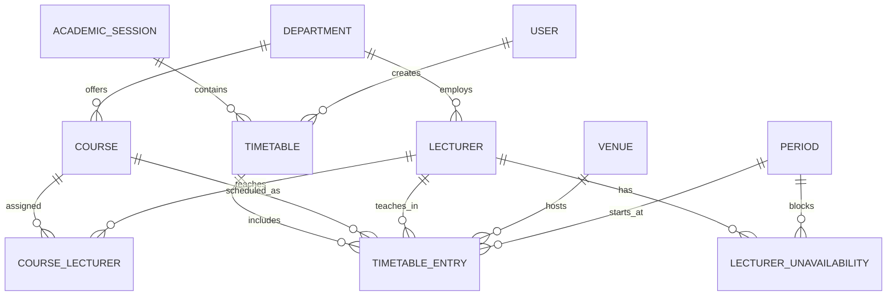

# PRD: Smart Timetable Generation System

**Design and Implementation of a Smart Timetable Generation System Using Constraint-Based Scheduling**

| Field | Value |
|---|---|
| Document type | Product Requirements Document (PRD) |
| Author | Abdulhameed |
| Project type | Final Year Project (B.Sc. Computer Science) |
| Status | Draft v1.0 |
| Architecture | Django monolith (server-rendered templates + HTMX + Alpine.js) |
| Primary deliverable | Working web application + evaluation results |

---

## 0. How to use this document (for Claude Code)

This PRD is the single source of truth for building the system. When implementing:

1. **Build in the phases defined in §15.** Do not jump ahead. Each phase has acceptance criteria — verify them before moving on.
2. **Honour the data model in §9 exactly.** Field names, relationships, and constraints are intentional.
3. **The scheduling engine (§8) is the academic core.** Implement it as specified, with the named heuristics, so the algorithm is defensible in a viva. Keep it readable and well-commented.
4. **The design system (§12) is non-negotiable styling.** Use the exact tokens. Do not introduce gradients, drop shadows (beyond the single 2px offset), or bouncy animation.
5. Write tests as you go (§14). The evaluation chapter of the report depends on measurable test output.
6. Prefer the **latest stable** versions of all tools/libraries at build time; the versions below are a floor, not a ceiling. Verify current stable releases before pinning.

A companion `CLAUDE.md` (coding conventions, commands, structure) should be generated from §11 + §13 so future Claude Code sessions stay consistent.

---

## 1. Executive summary

Manual timetable construction at university departments is slow, error-prone, and produces clashes (a lecturer or venue double-booked, an oversized class in a tiny room). This project delivers a **web application that generates conflict-free timetables automatically** using **constraint-based scheduling**, then lets staff review, adjust, and publish them.

The system treats timetabling as a **Constraint Satisfaction Problem (CSP)**. A greedy assignment algorithm with backtracking enforces *hard constraints* (clashes that must never occur) while a scoring function optimises *soft constraints* (quality-of-life preferences). The result is a published, exportable timetable plus quantitative evidence that the system reduces conflicts and time versus manual methods.

---

## 2. Problem statement & motivation

Departments typically build timetables by hand in spreadsheets. This has well-known failures:

- **Clashes are easy to miss.** A human cannot reliably hold every lecturer/venue/course constraint in mind at once.
- **It does not scale.** Each added course or shared venue multiplies the checks required.
- **Changes are expensive.** A single venue becoming unavailable can force a manual re-check of the whole grid.
- **No optimisation.** Even a clash-free manual timetable rarely balances load across days or avoids back-to-back fatigue.

**Thesis:** Modelling the problem as a CSP and solving it algorithmically eliminates hard clashes by construction and measurably reduces the time and effort to produce a usable timetable.

This is what the project must *demonstrate*, because examiners will look for: (1) problem understanding, (2) algorithmic thinking, (3) sound system design, (4) a working implementation, and (5) evaluation evidence.

---

## 3. Goals & objectives

**Primary goals**

- G1. Capture all scheduling inputs (courses, lecturers, venues, time slots) through a clean admin interface.
- G2. Generate a timetable that satisfies **100% of hard constraints** (zero clashes) for a feasible dataset.
- G3. Optimise soft constraints via a transparent scoring function.
- G4. Allow staff to review, manually adjust, regenerate, and **publish** timetables.
- G5. Export the published timetable to **PDF and Excel**.
- G6. Produce **evaluation metrics** (conflict count, generation time, venue utilisation, soft-violation score) to evidence effectiveness.

**Non-goals (out of scope)**

- Student-level enrolment / personalised student timetables (system schedules *course offerings*, not individuals).
- Exam timetabling (different constraint set; mention only as future work).
- Multi-faculty federation, payroll, or LMS integration.
- Mobile native apps.
- Advanced AI/ML (genetic algorithms, ILP solvers) — **deliberately excluded**; correctness and clarity earn the marks. These belong in §16 Future Work.

---

## 4. User roles & permissions

The system uses a custom user model with a `role` field. Roles are mutually exclusive.

| Role | Can do | Cannot do |
|---|---|---|
| **Admin** | Everything below + manage users, departments, global settings (days, periods, academic session), and system configuration | — |
| **Timetable Officer** | Manage courses/lecturers/venues/slots, run generation, manually adjust entries, publish timetables | Manage users or global settings |
| **Viewer** *(optional, Phase 3)* | View and export **published** timetables only | Edit any data, run generation |

Authentication is required for all write actions. Published timetables *may* optionally be viewable via a read-only public link (config flag, default off).

Implementation: extend `AbstractUser` with `role = models.CharField(choices=Role.choices)`. Enforce permissions with a custom decorator/mixin (`@role_required(...)`) and Django's permission system. Do **not** rely solely on hiding UI elements.

---

## 5. Scope summary (in / out)

**In scope:** data management CRUD, constraint-based generation, conflict reporting, manual adjustment with live clash validation, publish workflow, PDF/Excel export, evaluation dashboard, role-based access.

**Out of scope:** see §3 non-goals.

---

## 6. Functional requirements

### 6.1 Data management (Module A)

CRUD for the following, scoped to the active academic session/semester:

- **Departments** — name, code.
- **Courses** — code, title, credit units, department, expected class size, weekly sessions, session length (in periods), required venue type.
- **Lecturers** — name, staff email, department, plus **availability** (which day/period combinations they are *unavailable*).
- **Course assignments** — which lecturer(s) teach which course.
- **Venues** — name, capacity, type (lecture hall / lab / seminar room), optional building/location.
- **Time configuration** — working days, periods per day (with start/end times). Defined once in global settings.

Requirements:

- FR-A1. All list views support search, filter (by department/type), and pagination.
- FR-A2. Inline create/edit via HTMX modals without full page reloads.
- FR-A3. Validation: course codes unique per session; venue capacity > 0; lecturer email valid; a course must have ≥1 assigned lecturer before it can be scheduled.
- FR-A4. Bulk import of courses/lecturers/venues from CSV (Phase 3, optional but valuable for demoing scale).

### 6.2 Timetable generation (Module B) — see §8 for the engine

- FR-B1. Officer selects an academic session/semester and clicks **Generate**.
- FR-B2. Generation runs the constraint solver and produces a **Draft** timetable.
- FR-B3. The system reports: sessions successfully scheduled, any **unschedulable** sessions (with the reason — e.g. "no venue with capacity ≥ 120 free in any valid slot"), hard-constraint violations (must be 0), soft-constraint score, and generation time.
- FR-B4. Generation must be **idempotent and re-runnable**; re-generating replaces the draft cleanly (no orphaned entries).
- FR-B5. Long generation should not block the UI indefinitely — show progress (Phase 2 can use Channels; Phase 1 may use a simple synchronous run with a loading state, since datasets are modest).

### 6.3 Review & manual adjustment (Module C)

- FR-C1. Draft timetable renders as a **grid** (days × periods), filterable by department, lecturer, or venue.
- FR-C2. Officer can **move** an entry to a different slot/venue (drag-and-drop via Alpine.js, or select-and-place fallback).
- FR-C3. **Live validation:** before committing a move, the system checks hard constraints and **blocks** moves that create a clash, showing exactly which constraint failed (HTMX request → server validates → returns OK/error). Never allow the UI to persist an invalid state.
- FR-C4. Officer can manually place an unschedulable session if they create capacity (e.g. after editing data).
- FR-C5. A **conflicts panel** lists any remaining issues and stays in sync after every edit.

### 6.4 Publishing (Module D)

- FR-D1. A draft can be **published** only if it has zero hard-constraint violations and zero unscheduled sessions (or the officer explicitly acknowledges leftovers).
- FR-D2. Published timetables are read-only; further edits require creating a new draft (versioning by status, see §9 `Timetable.status`).
- FR-D3. Viewers (and optional public link) see only published timetables.

### 6.5 Export (Module E)

- FR-E1. Export published (and draft, for officers) timetables to **PDF** — clean, print-ready grid honouring the design system.
- FR-E2. Export to **Excel (.xlsx)** — one sheet for the master grid, plus optional per-department / per-lecturer sheets.
- FR-E3. Exports include header metadata: department, session, semester, generated date.

### 6.6 Evaluation dashboard (Module F) — academic value

- FR-F1. Display metrics for the current timetable: total sessions, conflicts (target 0), soft-violation score, generation time (ms), **venue utilisation %**, **per-day load distribution**, **back-to-back count per lecturer**.
- FR-F2. Allow **before/after or manual-vs-generated comparison** input so the report can quantify improvement (e.g. record a "manual baseline" conflict count/time and show the delta).
- FR-F3. Charts use the design system palette (single accent), no decorative chrome.

---

## 7. Non-functional requirements

- **NFR-1 Correctness:** for a feasible dataset, a published timetable has **zero** hard-constraint violations. This is the headline guarantee.
- **NFR-2 Performance:** generation for a realistic departmental dataset (~50 courses, ~20 lecturers, ~15 venues, 5 days × 8 periods) completes in **under a few seconds**.
- **NFR-3 Transparency:** the solver explains *why* a session could not be placed. No silent failures.
- **NFR-4 Usability:** core flows (add data → generate → review → publish → export) achievable without documentation.
- **NFR-5 Security:** role-enforced access on the server; CSRF protection on all mutations; secrets via environment variables (`.env`, never committed).
- **NFR-6 Maintainability:** typed where practical, docstrings on the engine, ≥1 test per constraint rule.
- **NFR-7 Reproducibility:** Dockerised; `docker compose up` brings the app + DB online.

---

## 8. The scheduling engine (academic core)

> This is the section examiners will scrutinise most. Implement it as a clearly separated, well-tested module (`scheduling/engine/`) with no Django imports inside the core algorithm — pass in plain data structures so the algorithm is unit-testable and the reasoning is portable.

### 8.1 Problem framing

Timetabling is modelled as a **Constraint Satisfaction Problem (CSP)**:

- **Variables:** each *session to be scheduled*. A course requiring `weekly_sessions` sittings produces that many variables. Each session knows its course, an assigned lecturer, required venue type, class size, and `session_length` (consecutive periods needed).
- **Domain of a variable:** the set of valid `(day, start_period, venue)` placements where the venue type matches, venue capacity ≥ class size, the placement fits within the day (start_period + session_length ≤ periods/day), and the lecturer is available across those periods.
- **Constraints:** the hard and soft constraints below.

### 8.2 Hard constraints (must never be violated)

| ID | Constraint |
|---|---|
| H1 | A lecturer cannot teach two sessions overlapping in time. |
| H2 | A venue cannot host two sessions overlapping in time. |
| H3 | The same course cannot be scheduled twice in the same time slot. |
| H4 | Venue capacity ≥ class size. |
| H5 | A session must lie entirely within the lecturer's availability. |
| H6 | A session must fit within configured working hours (no overflow past the last period). |

A solution that violates any hard constraint is **invalid** and must never be published.

### 8.3 Soft constraints (optimised, not required)

Each adds a weighted penalty to a candidate placement's score:

| ID | Soft constraint | Default weight |
|---|---|---|
| S1 | Avoid back-to-back sessions for the same lecturer (gap preferred). | 3 |
| S2 | Distribute a department's courses **evenly across days** (penalise day overload). | 2 |
| S3 | Avoid large idle gaps in a lecturer's day. | 1 |
| S4 | Prefer earlier periods over very late ones (configurable). | 1 |

Weights live in config so they can be tuned and discussed in the evaluation.

### 8.4 Algorithm: greedy assignment with backtracking + scoring

The chosen approach is a **constructive greedy solver guided by CSP heuristics, with bounded backtracking**, and a **scoring function** to choose among hard-valid placements. This is the deliberate sweet spot: more complete than naive greedy, far simpler than ILP/genetic methods, and fully explainable.

**Heuristics (name these in the report — they are standard CSP techniques):**

- **MRV (Minimum Remaining Values):** schedule the *most constrained session first* — the one with the smallest current domain. This front-loads the hard placements and reduces dead-ends.
- **Degree heuristic** as a tie-breaker: prefer sessions involving the busiest lecturers/scarcest venue types.
- **LCV-style scoring** when choosing a placement: among hard-valid candidates, pick the one with the best soft score (least constraining / highest quality).

**Pseudocode**

```text
function generate(sessions, days, periods, venues):
    schedule = empty assignment            # session -> (day, start_period, venue)
    unscheduled = []

    # Order sessions by MRV (smallest domain first), degree as tie-break
    order = sort sessions by (domain_size asc, lecturer_load desc)

    result = backtrack(order, index=0, schedule, attempts=0)
    return result   # { schedule, unscheduled, hard_violations: 0, soft_score, time }

function backtrack(order, index, schedule, attempts):
    if attempts > MAX_ATTEMPTS:           # guard against exponential blow-up
        return PARTIAL
    if index == len(order):
        return COMPLETE                   # all sessions placed

    session = order[index]
    candidates = hard_valid_placements(session, schedule)   # enforces H1..H6

    if candidates is empty:
        mark session unscheduled (with reason); 
        return backtrack(order, index+1, schedule, attempts+1)

    # Order candidates best-soft-score first
    candidates = sort candidates by soft_score(session, placement, schedule) asc

    for placement in candidates:
        assign session -> placement in schedule
        outcome = backtrack(order, index+1, schedule, attempts+1)
        if outcome == COMPLETE:
            return COMPLETE
        undo assignment                    # backtrack

    # No candidate led to completion: leave unscheduled, continue
    mark session unscheduled (with reason)
    return backtrack(order, index+1, schedule, attempts+1)
```

**Key implementation notes**

- `hard_valid_placements` is the single chokepoint enforcing H1–H6. Every constraint should be a small, individually testable predicate so a viva question like "show me where H2 is enforced" has a one-line answer.
- `soft_score` returns the **sum of weighted penalties**; lower is better. It is pure (no side effects) and unit-testable.
- Backtracking is **bounded** (`MAX_ATTEMPTS`) so the system always returns in reasonable time. If the dataset is infeasible, the system returns a **partial** schedule plus a clear list of unscheduled sessions and reasons — this is correct behaviour, not a bug, and demonstrates honest engineering.
- Provide a **pure-greedy mode** (no backtracking) behind a flag, so the evaluation can compare greedy vs greedy+backtracking completeness — excellent material for the report.

### 8.5 Engine outputs

```text
GenerationResult {
    entries: list[ScheduledSession]      # the placements
    unscheduled: list[{session, reason}]
    hard_violations: int                 # MUST be 0 for any saved valid solution
    soft_score: int                      # lower is better
    metrics: {
        generation_time_ms, venue_utilisation_pct,
        per_day_counts, back_to_back_count, ...
    }
}
```

The Django layer persists `entries` as `TimetableEntry` rows and stores `metrics` for the dashboard.

---

## 9. Data model

> Use Django ORM. Names below are the model names. Use `created_at`/`updated_at` audit fields on all tables. Scope schedulable data to an `AcademicSession` + `semester` where relevant.

### 9.1 Entities

**User** (custom, extends `AbstractUser`)
- `role`: enum {ADMIN, TIMETABLE_OFFICER, VIEWER}

**Department**
- `name`, `code` (unique)

**AcademicSession** (global config holder)
- `name` (e.g. "2025/2026"), `is_active` (bool), `semester` (enum: FIRST/SECOND)

**TimeConfig / Period** (the day×period grid)
- `Day`: enum or table of working days (MON…FRI by default, configurable)
- `Period`: `index` (1..N), `start_time`, `end_time`, `label`

**Lecturer**
- `name`, `email` (unique), `department` (FK)

**LecturerUnavailability**
- `lecturer` (FK), `day`, `period` (FK) — rows mark when a lecturer is NOT available

**Venue**
- `name` (unique), `capacity` (int > 0), `venue_type` (enum: LECTURE_HALL/LAB/SEMINAR), `location` (optional)

**Course**
- `code` (unique per session), `title`, `credit_units` (int)
- `department` (FK)
- `class_size` (int) — expected enrolment
- `weekly_sessions` (int, default derived from credit units)
- `session_length` (int periods, default 1)
- `required_venue_type` (enum, default LECTURE_HALL)

**CourseLecturer** (M2M through table: which lecturer teaches a course)
- `course` (FK), `lecturer` (FK)

**Timetable**
- `name`, `academic_session` (FK), `semester`
- `status`: enum {DRAFT, PUBLISHED, ARCHIVED}
- `created_by` (FK User), `generated_at`
- `soft_score`, `generation_time_ms`, `metrics` (JSON)

**TimetableEntry** (one scheduled session)
- `timetable` (FK)
- `course` (FK), `lecturer` (FK), `venue` (FK)
- `day`, `start_period` (FK Period), `length` (int periods)
- DB-level uniqueness/integrity supported by app-level constraint checks (H1–H6)

### 9.2 ERD



---

## 10. System architecture

A pragmatic **Django monolith** with server-rendered HTML, progressively enhanced by HTMX and Alpine.js. No separate SPA, no REST API surface required for Phase 1 (the spec calls for HTMX, not DRF).

```text
Browser (HTML + HTMX + Alpine.js)
        │  HTML-over-the-wire (HTMX requests return partials)
        ▼
Django views & templates ──► Scheduling engine (pure Python, no Django imports)
        │
        ▼
ORM ──► PostgreSQL (prod) / SQLite (dev)
        │
        ▼
Export services (PDF, Excel)   [optional] Channels + Redis for live updates (Phase 2)
```

**Layering rules**

- `scheduling/engine/` is framework-agnostic pure Python (testable in isolation).
- Views are thin: gather ORM data → convert to plain dataclasses → call engine → persist results.
- Templates return **partials** for HTMX swaps (e.g. a single grid cell, a modal, the conflicts panel).

---

## 11. Tech stack

| Layer | Choice | Notes |
|---|---|---|
| Language | Python 3.12+ | latest stable at build time |
| Backend | Django (latest stable LTS, ≥5.x) | server-rendered |
| Templating | Django Templates | returns HTMX partials |
| Dynamic UX | HTMX (≥2.x) | partial updates, no full reloads |
| Client state | Alpine.js (≥3.x) | modals, drag-and-drop, toggles |
| Real-time (optional) | Django Channels + Redis | Phase 2 only — live regeneration progress / collaboration |
| Database | PostgreSQL (prod), SQLite (dev) | matches deployable target |
| Algorithm | Pure Python in `scheduling/engine/` | the academic core |
| PDF export | WeasyPrint (HTML→PDF, honours CSS) | preferred so PDF matches the design system; ReportLab acceptable fallback |
| Excel export | openpyxl | styled grid |
| Charts (dashboard) | Lightweight (Chart.js or server-rendered SVG) | single-accent palette only |
| Packaging | Docker + docker compose | `docker compose up` runs app + DB |
| Config | django-environ / `.env` | **never commit secrets** |
| Testing | pytest + pytest-django | engine tests are framework-free |
| Lint/format | ruff + black | |

> Confirm latest stable versions before pinning in `requirements.txt` / `pyproject.toml`.

---

## 12. Design system (CAD / blueprint aesthetic)

The UI must read like a **precision engineering tool** — drafting paper, technical annotations, graph-paper grid. Implement these as CSS custom properties and use them everywhere. **No deviations.**

```css
:root {
  /* Surface */
  --bg:            #F5F2EB;   /* muted off-white — drafting paper */
  --surface:       #FBF9F4;   /* slightly lighter panels */
  --ink:           #1E1E1C;   /* deep charcoal — primary UI/text */
  --ink-soft:      #4A4A46;   /* secondary text */
  --rule:          #D7D2C6;   /* 1px graph-paper grid lines */
  --rule-strong:   #B8B2A4;   /* major grid lines */

  /* Single accent — choose ONE. Default: vermillion. */
  --accent:        #C7401F;   /* vermillion red (default) */
  /* --accent:     #1B3A5C;   // OR deep engineering blue — swap this single line */
  --accent-tint:   color-mix(in srgb, var(--accent) 12%, transparent);

  /* Type */
  --font-display:  "Playfair Display", Georgia, serif;   /* headings */
  --font-ui:       "IBM Plex Mono", ui-monospace, monospace; /* UI + numbers */

  /* Motion + shape */
  --ease:          cubic-bezier(0.4, 0, 0.2, 1);
  --dur:           150ms;
  --shadow:        2px 2px 0 var(--rule-strong); /* the ONLY shadow allowed */
  --radius:        0px;       /* sharp, technical corners (or max 2px) */
}
```

**Rules**

- **Typography:** Playfair Display for headings only (editorial, authoritative). IBM Plex Mono for all UI text, labels, and especially times/numbers. Use `font-variant-numeric: tabular-nums` on every numeric/time element so columns align like a spec sheet.
- **Grid:** the timetable is drawn on graph paper — `1px` rule lines (`--rule`), major lines (`--rule-strong`) at day boundaries, precise even spacing. Period labels are small mono annotations along the axis, like dimension callouts on a technical drawing.
- **Accent:** exactly one colour, used *only* for active selection and generated/highlighted output. Everything else is charcoal-on-cream. Resist using accent for decoration.
- **Motion:** only `150ms ease-in-out` on state changes. No bounce, no spring, no parallax.
- **Depth:** **no gradients. No drop shadows** except the single clean `2px` offset box-shadow (`--shadow`). Borders, not shadows, define structure.
- **Affordances:** buttons are bordered rectangles; hovers shift the border/accent, not the elevation. Modals appear with a flat offset shadow and a 150ms fade.

The PDF export should reproduce this aesthetic (which is why WeasyPrint is preferred — it renders the same CSS).

---

## 13. Screen specifications

| # | Screen | Key elements |
|---|---|---|
| 1 | **Login** | Minimal centred card, mono inputs, accent on focus only. |
| 2 | **Dashboard** | At-a-glance counts (courses, lecturers, venues), active session, latest timetable status, quick "Generate" CTA. |
| 3 | **Data: Courses / Lecturers / Venues** | Tabular lists (mono, tabular figures), search + filter, HTMX modal create/edit, inline delete with confirm. |
| 4 | **Lecturer availability** | Day×period grid; click to toggle a cell unavailable (accent marks blocked cells). |
| 5 | **Time configuration** | Define working days + periods (start/end). Admin only. |
| 6 | **Generate** | Select session/semester → Generate button → result summary panel (scheduled / unscheduled / score / time) → link to review. |
| 7 | **Timetable grid (review)** | Graph-paper days×periods grid; entries as bordered blocks; filter by department/lecturer/venue; drag-and-drop move (Alpine) with **live server-side clash validation**; conflicts panel pinned to the side. |
| 8 | **Conflicts panel** | Live list of any hard violations / unscheduled sessions, each with a reason and a jump-to action. |
| 9 | **Publish** | Confirm publish (gated on zero hard violations); shows resulting read-only timetable. |
| 10 | **Evaluation dashboard** | Metric cards + minimal charts (utilisation, per-day distribution, back-to-back counts); manual-baseline comparison input. |
| 11 | **Export** | Buttons for PDF / Excel; respects current filter. |

---

## 14. Testing & evaluation strategy

> The evaluation chapter of the report draws directly from this. Make outputs measurable and reproducible.

### 14.1 Engine unit tests (most important)

- One test per hard constraint (H1–H6) asserting a violating placement is rejected.
- Tests asserting `soft_score` increases when a soft constraint (S1–S4) is breached.
- A **feasible fixture** → assert `hard_violations == 0` and all sessions scheduled.
- An **infeasible fixture** (e.g. one venue, too many simultaneous large classes) → assert the system returns a partial schedule with correct unscheduled reasons, never an invalid published one.
- A **determinism test**: same input + same config + fixed ordering → same output.

### 14.2 Integration / view tests

- Role enforcement: a Viewer cannot reach generation/edit endpoints (403).
- Manual move endpoint rejects clash-creating moves and accepts valid ones.
- Publish is blocked when hard violations exist.

### 14.3 Evaluation experiments (for the report)

Produce a results table across increasing dataset sizes (e.g. 10 / 30 / 50 / 80 courses):

| Metric | What it shows |
|---|---|
| Hard violations | Always 0 for feasible sets — the core guarantee. |
| Generation time (ms) | Scales acceptably; quantifies the speed advantage over manual. |
| Sessions scheduled / total | Completeness. |
| Soft-violation score | Quality; compare greedy vs greedy+backtracking. |
| Venue utilisation % | Efficiency of room use. |
| Manual baseline vs generated | Record a hand-built baseline's conflicts + time; report the reduction. This directly answers "does it reduce conflicts and time?" |

Seed a realistic demo dataset (real-ish department) via a `seed` management command so results are reproducible during the viva.

---

## 15. Implementation plan (phased — build in this order)

### Phase 0 — Foundation
- Django project, Docker + compose (app + Postgres), `.env` config, base templates, design-system CSS tokens (§12), HTMX + Alpine wired in.
- Custom User model + roles + auth + `@role_required`.
- **Acceptance:** `docker compose up` serves a styled login; roles enforced; CI-style `pytest` runs green (even if trivial).

### Phase 1 — Data management (Module A)
- Models per §9 + migrations + admin.
- CRUD screens for departments, courses, lecturers (+ availability grid), venues, time config, with HTMX modals + validation.
- Seed command with a realistic dataset.
- **Acceptance:** all data can be created/edited/deleted through the UI; validation rules hold; seed populates a demo session.

### Phase 2 — Scheduling engine (Module B) — the core
- `scheduling/engine/` pure-Python solver: domains, H1–H6 predicates, MRV ordering, soft scoring, bounded backtracking, pure-greedy flag.
- Full engine unit-test suite (§14.1).
- Django generation view → persists `Timetable` (DRAFT) + `TimetableEntry` + metrics; result summary screen.
- **Acceptance:** feasible fixture yields zero hard violations, all sessions placed; infeasible fixture yields a correct partial result with reasons; tests green.

### Phase 3 — Review, validation & publish (Modules C, D)
- Graph-paper grid render; filters; drag-and-drop with **live server-side clash validation**; conflicts panel; publish workflow + status; optional Viewer role.
- **Acceptance:** invalid moves are blocked with a clear reason; publish gated on zero violations; published timetables are read-only.

### Phase 4 — Export & evaluation (Modules E, F)
- PDF (WeasyPrint, design-system styled) and Excel (openpyxl) export.
- Evaluation dashboard with metrics + charts + manual-baseline comparison.
- Run evaluation experiments, capture results table.
- **Acceptance:** exports match the on-screen grid; dashboard shows accurate metrics; results table reproducible from the seed command.

### Phase 5 — Optional enhancements
- CSV bulk import; Django Channels + Redis for live generation progress / collaborative editing; public read-only link.

---

## 16. Future work (report-ready extensions)

- Genetic algorithm / simulated annealing for soft-constraint optimisation on large datasets.
- Integer Linear Programming (ILP) formulation for provably optimal solutions.
- Student-level enrolment and personalised timetables.
- Exam timetabling mode (different constraint set).
- Multi-department / faculty-wide scheduling with shared venues.

---

## 17. Suggested repository structure

```text
timetable/
├── docker-compose.yml
├── Dockerfile
├── pyproject.toml / requirements.txt
├── .env.example                 # committed; .env is NOT
├── manage.py
├── config/                      # settings, urls, asgi/wsgi
├── accounts/                    # custom User, roles, auth, permissions
├── core/                        # departments, academic session, time config
├── catalog/                     # courses, lecturers, venues, availability
├── scheduling/
│   ├── engine/                  # PURE python solver (no django imports)
│   │   ├── constraints.py       # H1..H6 predicates, S1..S4 penalties
│   │   ├── solver.py            # MRV ordering + backtracking + scoring
│   │   ├── types.py             # dataclasses: SessionVar, Placement, Result
│   │   └── tests/               # framework-free unit tests
│   ├── models.py                # Timetable, TimetableEntry
│   ├── views.py                 # generate / review / move / publish
│   └── services.py              # ORM <-> engine glue, persistence
├── exports/                     # pdf (weasyprint), excel (openpyxl)
├── dashboard/                   # evaluation metrics + charts
├── templates/                   # base + partials (HTMX targets)
└── static/css/tokens.css        # the design system (§12)
```

---

## 18. Acceptance criteria (definition of done)

The project is complete when:

1. ✅ An officer can enter all data, click Generate, and receive a timetable with **zero hard-constraint violations** for a feasible dataset.
2. ✅ The solver uses the documented CSP approach (MRV + backtracking + soft scoring) and is covered by passing unit tests for every hard constraint.
3. ✅ Unschedulable sessions are reported with clear reasons; nothing fails silently.
4. ✅ Manual edits are validated live and cannot create clashes.
5. ✅ Timetables can be published (read-only) and exported to PDF and Excel matching the design system.
6. ✅ The evaluation dashboard reports conflicts, generation time, utilisation, and a manual-vs-generated comparison.
7. ✅ Role-based access is enforced server-side.
8. ✅ `docker compose up` runs the full app; `pytest` is green; a seed command loads a demo dataset.
9. ✅ The UI consistently follows the CAD/blueprint design system — no gradients, no shadows beyond the single 2px offset, single accent, mono + Playfair typography, graph-paper grid.
